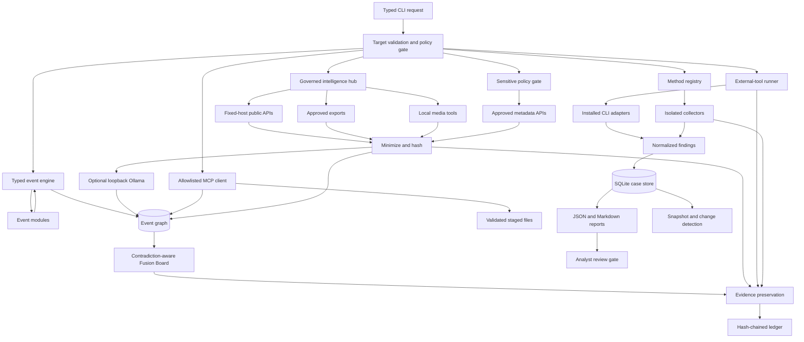

# Architecture

## Execution flow



## Design decisions

- **Standard-library first:** installation works offline and on low-resource ARM
  systems. Optional external adapters can be added without changing the core.
- **Typed targets:** collectors never guess whether a string is a URL, email,
  domain or file. This prevents accidental execution against the wrong asset.
- **Adapter isolation:** one network failure produces a partial run rather than
  destroying other results.
- **Evidence over conclusions:** collectors store observations. Attribution and
  intent remain analyst decisions.
- **Append-oriented custody:** preserved bytes are content-addressed; the ledger
  links every event to its predecessor.
- **Local by default:** no collected case content is sent to an LLM or vendor.
- **Bounded recursion:** the spider engine enforces depth and event ceilings,
  deduplicates typed data and rejects private-address network pivots.
- **No-shell integrations:** external tools receive validated argument arrays;
  the runner never interpolates a command into a shell string.
- **Two-step active consent:** direct probes require both `--authorized` and
  `--allow-active`, while high-scale or exploitation tools remain blocked.
- **Two-step sensitive consent:** sensitive workflows require `--authorized`,
  `--allow-sensitive`, a lawful purpose and an ownership/consent attestation.
- **Data minimization:** sensitive targets are stored as hashes; account aliases,
  BSSIDs and password hashes are fingerprinted, coordinates are coarsened, and
  raw breach rows are not copied into the case workspace.
- **Repeatable monitoring:** normalized sensitive results are hashed into case
  snapshots so scheduled runs report whether the redacted result set changed.
- **Platform-compliant social intelligence:** official/public APIs are used
  where available; access-restricted social networks use operator-supplied
  official or approved exports instead of authentication bypass or private
  scraping.
- **Untrusted-content isolation:** imported text, OCR and transcripts are data,
  never instructions. AI prompts explicitly separate evidence and all model
  output remains low-confidence advisory analysis.
- **Fixed connector destinations:** live intelligence connectors construct URLs
  for known API hosts. User input cannot select an arbitrary API endpoint.
- **Loopback-only AI:** optional Ollama analysis accepts only localhost HTTP
  endpoints, preventing accidental cloud disclosure of case evidence.
- **Staged-file boundary:** document/geospatial MCPs see only regular,
  content-validated, case-staged files; symlinks and arbitrary filesystem paths
  are rejected.
- **Contradiction-first fusion:** repeated claims from one source are capped;
  model outputs and inferences are discounted, and contrary evidence survives
  into the final analyst view.

## Extension contract

A collector accepts a validated `Target` and returns `list[Finding]`:

```python
def my_collector(target: Target) -> list[Finding]:
    return [Finding(
        title="Observation",
        value={"key": "value"},
        source="https://primary-source.example/",
        confidence=80,
        severity="info",
        observation="What the result does and does not establish.",
    )]
```

Register it in `collectors.COLLECTORS`, then add the collector name to the
appropriate method row in `playbooks.py`. Collectors should use public,
documented APIs, implement timeouts, preserve provenance, avoid authentication
bypass and never interpret absence as proof.

## Production roadmap

Version 1.1 adds the authenticated tenant/RLS, fixed queue, isolated worker and
read-only graph foundation. It deliberately does not turn Vercel into a scanner.

1. Verify RLS on a dedicated hosted project and automate disposable integration tests.
2. Deploy the worker with per-source egress and rate budgets.
3. Add encrypted secret references, member administration and approval workflows.
4. Add signed report manifests, external timestamping and backup restoration tests.
5. Add graph merge/split history, saved views and collaboration conflict rules.
