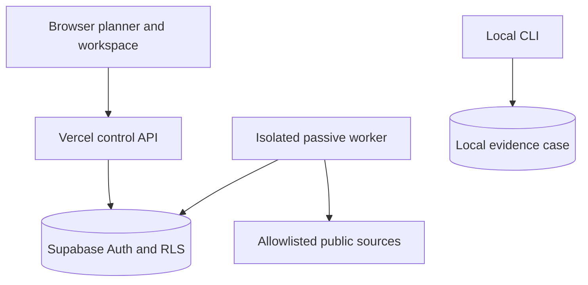

# Production architecture

## Trust boundaries

- Planner targets are browser-local. Signed-in cloud assets are explicit,
  organisation-owned records; the browser never receives server credentials.
- Vercel validates same-origin mutations and delegates object authorization to
  RLS. It cannot claim jobs or alter evidence.
- Only the worker has a server secret. It accepts fixed database job records,
  not arbitrary commands, URLs, packages, prompts or shell fragments.
- Cloud jobs are limited to passive domain, public-IP, public-URL metadata and
  file-hash reputation. Identity and private-network targets remain local.
- Provider content is untrusted data and is normalized, minimized and separated
  from analyst conclusions before persistence.

Atomic claiming and a 15-minute lease prevent simultaneous ownership. Failed or
stale jobs are bounded to five attempts. This foundation does not claim mature
collaboration, secret management or verified production operation until hosted
integration, monitoring and backup/restore gates are passed.

## Enterprise controls added in 1.6

- Every provider execution can be represented as a tenant-scoped `source_runs`
  record with idempotency, record counts, bounded failure codes and RLS.
- Per-case retention is restricted to owner/admin RPC calls. Legal holds block
  case deletion at the database boundary.
- Audit events reject update and delete operations at the database boundary.
- API responses include a validated or generated `X-Request-ID` for log and
  incident correlation.
- The authenticated `/api/workspace` endpoint returns a bounded timeline,
  coverage view and review queue using only RLS-filtered case objects.

MFA/SSO/SCIM, customer-managed KMS, verified backups, incident on-call and an
external penetration test are still deployment/operator obligations; this
repository does not claim them as complete.
