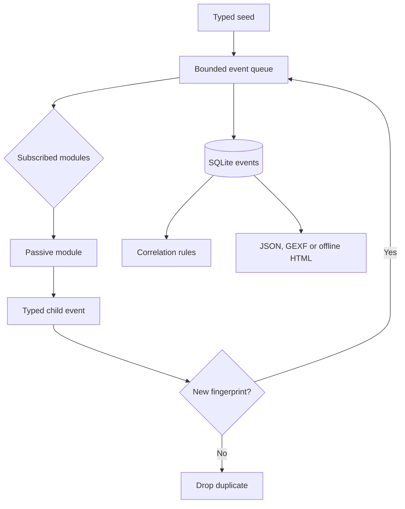

# Spider Event Engine

## Model

The engine uses a bounded event bus inspired by modular OSINT scanners:

1. A typed seed event enters a FIFO queue.
2. Every event is persisted before processing.
3. Modules declaring the event type in `watches` receive it.
4. Modules emit typed child events with source, parent, confidence and tags.
5. `(event_type, canonical data)` fingerprints remove duplicates per scan.
6. Processing stops at `max_depth` or `max_events`.
7. Explainable correlation rules evaluate the stored event set.



## Event fields

| Field | Purpose |
|---|---|
| `event_type` | Stable uppercase data type |
| `data` | JSON-serializable observation |
| `source_module` | Module that emitted the event |
| `parent_id` | Provenance edge to the triggering event |
| `depth` | Distance from the seed |
| `confidence` | Confidence in this observation, 0–100 |
| `risk` | `info`, `low`, `medium`, `high` or `critical` |
| `tags` | Qualifiers such as `candidate`, `ptr`, `san` |
| `fingerprint` | SHA-256 of canonical type and data |

## Module contract

```python
class MyModule(SpiderModule):
    name = "my_module"
    description = "Explain exactly what is observed."
    watches = frozenset({"DOMAIN"})
    produces = frozenset({"MY_EVENT"})
    passive = True

    def handle(self, event: Event) -> list[Event]:
        return [child(
            event, "MY_EVENT", {"observation": "value"}, self.name,
            confidence=70, tags=["primary-source"],
        )]
```

Instantiate it in `spider/modules.py::MODULES`. A production module should:

- use a documented public data source;
- set strict timeouts and source-specific rate limits;
- never bypass access controls or authentication;
- emit observations rather than identity/intent conclusions;
- refuse network pivots outside the authorized scope;
- catch malformed third-party data at the module boundary.

## Correlation policy

Correlation rules are registered as independent deterministic handlers and explain
their basis. The catalog flags multiple resolved addresses, non-public DNS results,
redirects, unobserved response-security headers, exact shared-IP observations,
certificate-metadata reuse, exact technology-marker overlap and redirect convergence.
The engine records extra provenance edges when two parents emit the same deduplicated
child. “Not observed” never means “does not exist,” and every rule sets
`requires_review: true`. No rule asserts identity, ownership or intent.

## Offline graph view

`traceatlas spider export --scan SCAN_ID --format html --output graph.html`
creates a self-contained, read-only graph. It has event-type and confidence filters,
node details and PNG export. The case data stays inside the exported local file; no
CDN or public API endpoint is required.

## Safety envelope

- Passive mode only.
- No port scanning, brute force, credential testing or exploit execution.
- Local/private/link-local network fetches are blocked.
- Network and identity seeds require `--authorized` in the CLI.
- Account URLs are tagged as unverified candidates.
- Recursion and total output have hard limits.
