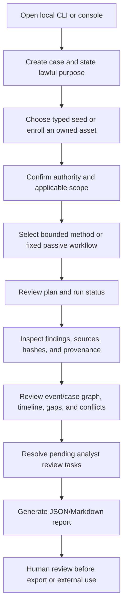

# TraceAtlas User Flows

## Main analyst flow

## By investigation type

| Investigation | Available path | Important boundary |
|---|---|---|
| Person | Local consent-gated professional-profile workflow and approved public/API imports | Subject consent and lawful purpose required; no home/family profiling. Cloud case assets exclude identity targets. |
| Company | Local public business/API, domain, archive, and supply-chain research methods where registered | Confirm the company or asset is in scope; sources and registry coverage vary. |
| Domain | Local domain playbooks, passive DNS/TLS/HTTP, public API sources, bounded Spider pivots, or cloud enrolled-asset workflow | Private/link-local destinations are rejected by network modules; active probes need extra authorization. |
| IP | Local public-IP enrichment and registered source connectors, or cloud enrolled-asset workflow | Geography is approximate; provider classifications are claims. Private/reserved IPs are not a public research target. |
| Threat actor | Local CTI feeds, IOC extraction, public-source research, and evidence-backed graph/fusion analysis | Attribution remains analytical and uncertain; no actor identity is asserted by a graph edge alone. |
| Malware | Local file metadata/hash and static/intelligence workflows where supported | The general/cloud worker does not execute samples; use a separately approved isolated sandbox for any execution. |
| IOC | Local CTI parsing, feed ingestion, observable normalization, correlation, and STIX output | Retain feed/source provenance, markings, expiry, and confidence; an IOC match does not prove attribution. |
| Supply chain | Local public company/supplier/API research and case graph correlation | Supplier relationships require cited records and dates; completeness depends on public/authorized source coverage. |

## Local CLI happy path

1. Initialize a case with a specific purpose.
2. List methods and select one compatible with the typed target.
3. Run the method with required authorization flags. Sensitive and active workflows need their additional explicit gates.
4. Inspect the run status and findings; verify evidence hashes/custody; create report output.
5. Review citations, stale evidence, conflicts, and unknowns before use.

## Authenticated cloud happy path

1. Configure the control plane and sign in.
2. Create or select an organization.
3. Open a case, enter its lawful purpose, and confirm authorization.
4. Enroll an organization-owned domain, public IP, URL, or hash with ownership basis.
5. Queue the fixed passive workflow for that asset and confirm authorization.
6. Review job status, evidence, graph, notes, and review tasks.
7. Close analyst review before external distribution.

The cloud API enforces same-origin writes and authenticated access. It must not be represented as a general person-search or arbitrary scanning interface.

## Empty states, errors, and partial results

- **No cases/assets:** create a purpose-bound case or enroll an owned asset before queueing work.
- **No evidence/findings:** report that no observation was recorded; do not claim the subject or indicator is absent.
- **Invalid target or missing authority:** correct the typed target or provide the required authorization/consent confirmation; do not bypass the gate.
- **Source timeout, unavailable adapter, or rate limit:** preserve other completed sources, label the run partial, and record the provider limitation.
- **Model/provider failure:** keep deterministic evidence and analysis available; model assistance is optional and must not change evidence.
- **Permission/tenant failure:** stop and correct account, organization, case, asset, or RLS configuration; never retry with broader privileges.
- **Budget/runtime exhaustion:** stop within configured caps, retain partial evidence, and make incompleteness visible.
- **Cancel/resume:** local commands can be stopped by the operator; cloud jobs have durable queued/running/terminal state and bounded worker leases. Resume/retry semantics depend on idempotency and worker policy, not a promise to reproduce remote results.
- **Report/export:** review the selected case and scope, then inspect citations and provenance. Export does not itself authorize publication.

## Known limitations

Connector availability depends on installed tools, credentials, licenses, provider health, and jurisdiction. Social/public-record coverage varies by provider. A report or graph does not certify truth, identity, or completeness. The deployment state must be checked independently; repository documentation is not proof that a production service is live.
# Investigator user flows

| Investigation | Seed | Executable source mode | Boundary |
|---|---|---|---|
| Person | `person:synthetic-analyst` | Approved records | No private discovery; possible identity only |
| Company | `company:synthetic-company` | Approved records | Registry assertions require source review |
| Domain | `domain:example.org` | Approved records or fixed-host DNS/RDAP/archive | Exact scope; no discovered-domain pivots |
| IP | Authorized global IPv4/IPv6 | Approved records or RDAP/InternetDB | IPv6 excludes InternetDB; no scanning |
| IOC | Controlled domain/IP assertion | Shared backbone fixture | Native CTI engine exists separately |
| Threat actor | Controlled public-source assertions | Shared backbone fixture | No autonomous attribution |
| Malware | Inert static-analysis assertions | Shared backbone fixture | No specimen execution |
| Supply chain | Controlled company dependency assertions | Shared backbone fixture | No native BOM import in this slice |

Local happy path: create case → register authority → define objective/seed → plan
→ approve exact digest → run → inspect product evidence/graph/timeline/claims →
review verification/gaps → retain draft → replay. Login/tenant dashboard applies
to the existing hosted surface; local access depends on OS/workspace permissions.

Empty results are PARTIAL with `no-source-observations`. Source failures preserve
successful evidence and stable failure codes. Unavailable models do not affect
this deterministic runner. Expired/mismatched permission fails before dispatch.
Budget exhaustion skips further requests and preserves unknowns. Detected source
instructions have no action authority and prevent SUPPORTED promotion.

Pause/cancel/resume of this new workflow are not implemented. The kill switch
stops new dispatch; transport timeout bounds an in-flight request. Completed-task
retry returns its immutable product. A failed task needs a new approved task;
interrupted acquisition can leave captured but unreferenced bytes. Do not call
that distributed exactly-once execution. See RUNBOOK.md for concrete commands.
