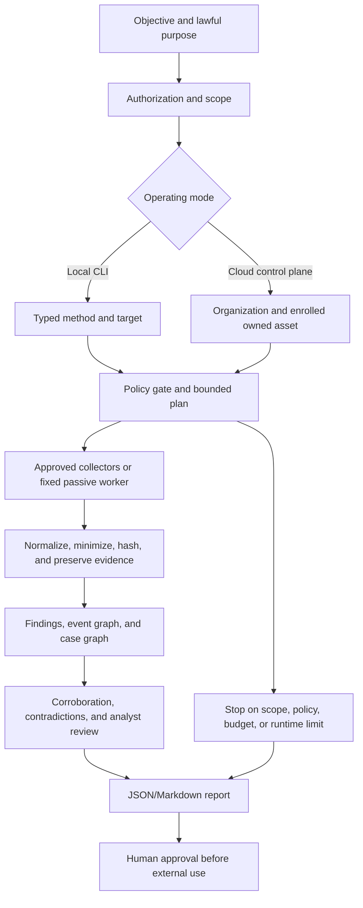
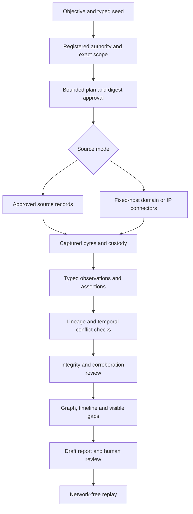

# TraceAtlas Investigation Workflow

## Purpose and operating modes

TraceAtlas has two distinct operating modes:

1. **Local CLI:** case data is kept in the selected local workspace, with SQLite case records, normalized findings, preserved evidence, and a hash-chained custody ledger.
2. **Authenticated cloud control plane:** analysts create an organization and case, enroll organization-owned assets, and queue a fixed passive workflow. A separate worker performs the approved workflow. Vercel API functions do not run scanners.

The local CLI offers broader playbooks and adapters. Cloud workflows intentionally restrict targets to enrolled organization-owned domains, public IPs, URLs, and hashes; identity targets are not accepted in the cloud path. Do not confuse the local planner with cloud authorization or collection.

## Lifecycle

1. **Define objective and purpose.** Create a case with a concise title and lawful purpose. Keep one lawful purpose per case.
2. **Establish authority and scope.** For local collection, select a typed target and use the method's required authorization flags. Active probing and sensitive workflows have additional confirmation gates. In the cloud control plane, an analyst must confirm authorization, select an organization, enroll an owned asset or document written authorization, and use only the fixed workflow supported for that asset type.
3. **Plan bounded work.** The deterministic method registry maps a method and typed target to collectors. The Spider engine expands typed events only within maximum depth/event limits. External adapters run only when installed and allowed. Planners do not grant authority.
4. **Collect.** Collectors use fixed public or operator-approved sources, explicit timeouts, response limits, and per-source safeguards. The cloud queue accepts only fixed passive workflows; it does not accept arbitrary commands.
5. **Preserve evidence.** Normalize results into typed findings and preserve eligible source artifacts with hashes, source, acquisition details, and case association. A chained local ledger makes subsequent changes detectable. Redaction and minimization rules apply to sensitive data.
6. **Correlate.** Deduplicate findings, retain provenance and confidence, connect typed Spider events and graph entities, and preserve conflicting evidence. A graph relationship is an association unless evidence and review establish a stronger interpretation.
7. **Analyze and verify.** The Fusion Board and workforce components can assist with evidence-grounded analysis, contradiction visibility, and review queues. Candidate entity resolutions remain pending until an analyst decides; model output is advisory and does not become evidence.
8. **Report.** Produce JSON or Markdown outputs and review the evidence trail, limitations, and unresolved questions before sharing. Analysts remain responsible for consequential use and external distribution.
9. **Monitor or repeat.** Bounded local schedules and monitoring snapshots can compare normalized outputs and report changes/failures. A repeated collection run is not a deterministic replay of every external source response.

## Evidence and claim discipline

The local evidence store and custody ledger are the record of what the software acquired or the analyst imported. A content hash detects changes to recorded bytes; it does not establish authenticity, source reliability, or lawful acquisition. Keep observations separate from claims and inferences. Preserve evidence provenance and contradictions. Do not silently merge identities: candidate matches require rationale and analyst decision.

## Stop conditions and failures

Stop when authorization is absent/ambiguous, a target falls outside scope, a policy gate rejects the action, a budget/deadline/rate limit is reached, or a source failure prevents safe continuation. Partial runs remain partial. A missing result is not proof of absence. Record unknowns and failures rather than filling gaps with model-generated conclusions.

## Current boundaries

The repository contains local automation, a bounded event engine, many source/tool adapters, CTI and analysis components, and authenticated cloud case/asset/job APIs. This document does not assert that every external adapter is installed, available, licensed, or execution-verified. Cloud identity collection is intentionally unavailable. Malware samples are not executed by the cloud worker; arbitrary code execution and unrestricted scans are out of scope. A production deployment must pass the repository's readiness and environment checks.
# Evidence-first investigation workflow

The local CLI is the executable path. The hosted UI is an existing separate
control plane; it does not launch this new pipeline.

Create a local case, register lawful purpose/actor/jurisdiction/retention and exact
seed scope, then plan and approve the immutable envelope digest. Planner source
selection uses seed type and implemented connector contracts. Domain chooses
DNS/RDAP/urlscan/archive; IPv4 chooses RDAP/IPWHOIS/InternetDB/urlscan; IPv6 excludes
InternetDB; CVE chooses NVD/EPSS; exact vulnerability IDs choose OSV; npm package
names choose npm registry metadata. Source IDs are bound into task constraints before digest approval.
Person and company select approved-record ingestion. Configure Brave or numeric
loopback SearXNG to execute the exact quoted domain/IP search; result URLs remain
leads with preserved search-response citations and no automatic fetch/pivot.

Before each request, runtime checks authority validity, deadline, kill switch,
tool/action permissions, remaining attempts and time. Provider retries use a
shared deadline; three historical failures open the existing health circuit.
A failure produces a stable coverage code, not a negative finding. Requests
cannot pivot to discovered targets or follow provider redirects.

Captured source documents contain original response text or operator-provided
text, structured extraction, acquisition/time/provenance and SHA-256 evidence.
Facts become observations, never model facts. Identical subject/predicate/value
assertions form a claim. Single-valued overlapping conflicts remain disputed;
multiple DNS addresses and nonoverlapping historical versions are not conflicts.
Source lineage uses transitive declared origin/ownership/copy relationships.

Verification checks captured bytes and case/acquisition links, independent groups,
contrary records, missing source values and detected instructions. It does not
perform an independent semantic adversarial search. Graph edges keep individual
observation validity intervals and proposed state. Person/company seeds remain
possible identities without merging. Timeline retains valid time and retrieval
time separately.

Information gaps and rule-ranked next checks are explicit. The single collection
cycle stops at source exhaustion, budget/policy boundary or human review; it does
not invent unconfigured sources or a calibrated information-gain model.
Security-metadata next actions require human comparison with authorized asset or
software inventory; advisory data never establishes deployment or exploitation.
Draft report/result/manifest commit together locally. Replay validates all stored
digests, custody and captured input bytes, then recomputes substantive analysis
using the recorded workflow/parser/policy versions with no network/model call.
