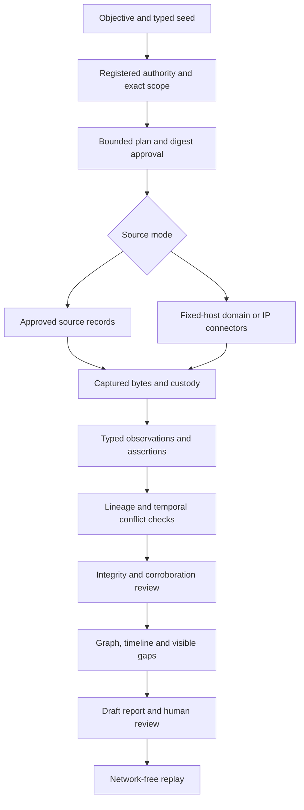

# Evidence-first investigation workflow

The local CLI is the executable path. The hosted UI is an existing separate
control plane; it does not launch this new pipeline.

Create a local case, register lawful purpose/actor/jurisdiction/retention and exact
seed scope, then plan and approve the immutable envelope digest. Planner source
selection uses seed type and implemented connector contracts. Domain chooses
DNS/RDAP/archive; IPv4 chooses RDAP/InternetDB; IPv6 excludes InternetDB. Person
and company select approved-record ingestion. Queries are planning-only until
an approved search provider is configured.

Before each request, runtime checks authority validity, deadline, kill switch,
tool/action permissions, remaining attempts and time. Provider retries use a
shared deadline; three historical failures open the existing health circuit.
A failure produces a stable coverage code, not a negative finding. Requests
cannot pivot to discovered targets or follow provider redirects.

Captured source documents contain original response text or operator-provided
text, structured extraction, acquisition/time/provenance and SHA-256 evidence.
Facts become observations, never model facts. Identical subject/predicate/value
assertions form a claim. Single-valued overlapping conflicts remain disputed;
multiple DNS addresses and nonoverlapping historical versions are not conflicts.
Source lineage uses transitive declared origin/ownership/copy relationships.

Verification checks captured bytes and case/acquisition links, independent groups,
contrary records, missing source values and detected instructions. It does not
perform an independent semantic adversarial search. Graph edges keep individual
observation validity intervals and proposed state. Person/company seeds remain
possible identities without merging. Timeline retains valid time and retrieval
time separately.

Information gaps and rule-ranked next checks are explicit. The single collection
cycle stops at source exhaustion, budget/policy boundary or human review; it does
not invent unconfigured sources or a calibrated information-gain model. Draft
report/result/manifest commit together locally. Replay validates all stored
digests, custody and captured input bytes, then recomputes substantive analysis
using the recorded workflow/parser/policy versions with no network/model call.
